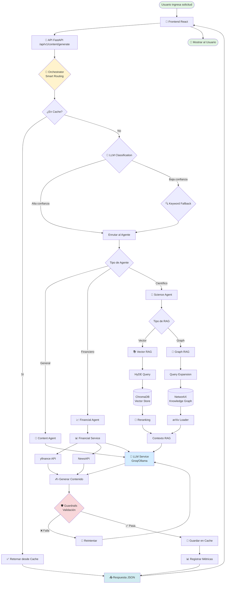

<div align="center">

#  Generador de Contenido con IA Multi-Agente

###  Plataforma Inteligente de Creación de Contenido

[](https://www.python.org/)
[](https://fastapi.tiangolo.com/)
[](https://react.dev/)
[](https://www.docker.com/)
[](https://langchain-ai.github.io/langgraph/)

[](LICENSE)
[]()

**Una plataforma avanzada de generación de contenido multi-agente potenciada por LLMs y RAG.**

[Repositorio](https://github.com/Bootcamp-IA-P5/Equipo_2_Proyecto_XI_LLMs_GENERADOR-DE-CONTENIDO)  [Gestión del Proyecto](https://github.com/orgs/Bootcamp-IA-P5/projects/29/views/1)  [Documentación de API](http://localhost:8000/docs)

---

###  Sistema Multi-Agente con RAG y Graph RAG para generación de contenido inteligente

*Proyecto de IA generativa end-to-end que combina arquitectura de agentes, recuperación aumentada con grafos de conocimiento y generación de contenido optimizado*

</div>

---

##  Descripción del Proyecto

Este proyecto ofrece una **plataforma completa de generación de contenido** potenciada por LLMs (Large Language Models) y una arquitectura de **Sistemas Multi-Agente**. El sistema combina técnicas avanzadas de **RAG (Retrieval-Augmented Generation)** con **Grafos de Conocimiento** para crear contenido de alta calidad, contextualizado y optimizado para diferentes plataformas y audiencias.

###  Objetivos Principales

|  Objetivo |  Descripción |
|------------|----------------|
| **Multi-Agente** | Orquestar agentes especializados (contenido, finanzas, ciencia) para generar contenido contextualizado |
| **RAG Avanzado** | Implementar recuperación de información con reranking, HyDE y expansión de queries |
| **Datos en Tiempo Real** | Integrar APIs financieras (yfinance) y papers científicos (arXiv) |
| **UX Moderna** | Interfaz reactiva con React 19 y Tailwind CSS para experiencia fluida |
| **IA Responsable** | Guardrails para asegurar contenido ético, seguro y de calidad |
| **Producción Ready** | Despliegue con Docker, CI/CD con GitHub Actions |

---

##  Características Principales

<div align="center">

|  Característica |  Detalle |
|-------------------|------------|
| **Agentes Disponibles** | Content (General), Financial (Tiempo Real), Science (RAG + arXiv) |
| **Plataformas Soportadas** | Twitter, LinkedIn, Instagram, Facebook, Blog |
| **Idiomas** | Español, Inglés |
| **LLM Providers** | Groq (llama-3.3-70b), Ollama (llama3.2 local) |
| **Fuentes de Datos** | yfinance (mercados), arXiv (papers científicos), NewsAPI |
| **Routing Inteligente** | LLM-based con fallback a keywords, caching, métricas |

</div>

###  Highlights Técnicos

<div align="center">

| Feature | Descripción |
|---------|-------------|
| ** Smart Routing** | LLM + Keywords, Confidence Scores |
| ** Enhanced RAG** | HyDE + Reranking, Query Expansion |
| ** Graph RAG** | Knowledge Graph, Relaciones Semánticas |
| ** Singleton LLM** | Recursos Optimizados, Conexión Compartida |
| ** Guardrails** | Validación Contenido, IA Responsable |
| ** Métricas** | Cache Hits, Processing Time |

</div>

---##  Arquitectura del Sistema

```

                               FRONTEND (React 19 + Vite)                  
│                     Tailwind CSS | react-markdown | Axios                   
──
                                       HTTP/REST
                                      
─
                            API GATEWAY (FastAPI)                          
                    /api/v1/content | /api/v1/health | CORS                  

                                      
                                      
─
                         ORCHESTRATOR (Routing Inteligente)                
              LLM Routing | Keyword Fallback | Caching | Metrics             
─
                                                              
                                                              
      
   Content Agent       Financial           Science Agent         
                           Agent                                       
   Blog posts           Market Data          arXiv Papers           
   Social media         Stock Prices         Graph RAG              
   General topics       Financial News       Scientific Content     
      
                                                            
                                                            
      
   LLM Service         Financial           Graph RAG Service     
    (Singleton)            Service                                     
   Groq API             yfinance API         VectorStore (Chroma)   
   Ollama Local         NewsAPI              KnowledgeGraph (NX)    
         arXiv Loader           
                                                
```

---

##  Stack Tecnológico

<div align="center">

| Backend | AI & LLM | Frontend |
|---------|----------|----------|
| FastAPI | LangChain / LangGraph | React 19 |
| Python 3.11 | ChromaDB (Vector Database) | Vite |
| PostgreSQL / SQLAlchemy | Groq / Ollama | Tailwind CSS |
| Pydantic v2 | Guardrails AI | Axios / React Router |

</div>

---

## 🔄 Flujo de Trabajo del Sistema

### Diagrama de Flujo Completo



### Flujo Detallado por Componente

#### 1. 🎯 Orchestrator - Routing Inteligente

```
┌─────────────────────────────────────────────────────────────┐
│                    ORCHESTRATOR FLOW                        │
├─────────────────────────────────────────────────────────────┤
│                                                             │
│  1. Recepción de Request                                    │
│     ↓                                                       │
│  2. ¿Existe en Cache? → SÍ → Retornar (Cache Hit)          │
│     ↓ NO                                                    │
│  3. LLM Classification                                      │
│     • Analiza el topic con LLM                              │
│     • Genera confidence score                               │
│     ↓                                                       │
│  4. ¿Confidence > 0.7?                                      │
│     ↓ SÍ                                                    │
│     └→ Enrutar al Agente seleccionado                       │
│     ↓ NO                                                    │
│  5. Keyword Fallback                                        │
│     • Busca keywords en topic                               │
│     • Mapea a agente apropiado                              │
│     ↓                                                       │
│  6. Ejecutar Agente + Guardar Métricas                      │
│                                                             │
└─────────────────────────────────────────────────────────────┘
```

#### 2. 📚 Science Agent - RAG Pipeline

```
┌─────────────────────────────────────────────────────────────┐
│                   SCIENCE AGENT RAG FLOW                    │
├─────────────────────────────────────────────────────────────┤
│                                                             │
│  Query del Usuario                                          │
│     ↓                                                       │
│  1. Query Expansion                                         │
│     • Genera variaciones de la query                        │
│     • Expande términos técnicos                             │
│     ↓                                                       │
│  2. HyDE (Hypothetical Document Embeddings)                 │
│     • Genera documento hipotético                           │
│     • Crea embedding del documento                          │
│     ↓                                                       │
│  3. Vector Search (ChromaDB)                                │
│     • Busca documentos similares                            │
│     • Top-K resultados (k=10)                               │
│     ↓                                                       │
│  4. Graph Search (NetworkX)                                 │
│     • Busca relaciones semánticas                           │
│     • Expande contexto con nodos conectados                 │
│     ↓                                                       │
│  5. Reranking                                               │
│     • Reordena resultados por relevancia                    │
│     • Selecciona Top-3 documentos                           │
│     ↓                                                       │
│  6. Context Assembly                                        │
│     • Combina documentos                                    │
│     • Formatea contexto para LLM                            │
│     ↓                                                       │
│  7. LLM Generation                                          │
│     • Genera respuesta con contexto RAG                     │
│     • Incluye citations/referencias                         │
│                                                             │
└─────────────────────────────────────────────────────────────┘
```

#### 3. 💰 Financial Agent - Real-Time Data

```
┌─────────────────────────────────────────────────────────────┐
│                  FINANCIAL AGENT FLOW                       │
├─────────────────────────────────────────────────────────────┤
│                                                             │
│  Request Financiero                                         │
│     ↓                                                       │
│  1. Extracción de Entidades                                 │
│     • Identifica tickers (AAPL, TSLA, etc.)                 │
│     • Identifica periodos de tiempo                         │
│     ↓                                                       │
│  2. Fetch Real-Time Data                                    │
│     ├→ yfinance API                                         │
│     │   • Precios actuales                                  │
│     │   • Datos históricos                                  │
│     │   • Métricas financieras                              │
│     │                                                       │
│     └→ NewsAPI (opcional)                                   │
│         • Noticias recientes                                │
│         • Eventos corporativos                              │
│     ↓                                                       │
│  3. Data Processing                                         │
│     • Calcula indicadores (ROI, volatilidad)                │
│     • Formatea datos para contexto                          │
│     ↓                                                       │
│  4. LLM Generation                                          │
│     • Genera análisis con datos reales                      │
│     • Incluye cifras actualizadas                           │
│     • Añade disclaimer responsable                          │
│                                                             │
└─────────────────────────────────────────────────────────────┘
```

#### 4. 🛡️ Guardrails - Validación de Contenido

```
┌─────────────────────────────────────────────────────────────┐
│                     GUARDRAILS FLOW                         │
├─────────────────────────────────────────────────────────────┤
│                                                             │
│  Contenido Generado                                         │
│     ↓                                                       │
│  1. Validación de Seguridad                                 │
│     • Sin contenido ofensivo                                │
│     • Sin información sensible                              │
│     • Sin contenido ilegal                                  │
│     ↓                                                       │
│  2. Validación de Calidad                                   │
│     • Longitud apropiada                                    │
│     • Estructura coherente                                  │
│     • Gramática correcta                                    │
│     ↓                                                       │
│  3. Validación de Plataforma                                │
│     • Límites de caracteres                                 │
│     • Formato apropiado (hashtags, etc.)                    │
│     • Tono adecuado                                         │
│     ↓                                                       │
│  4. Decisión                                                │
│     ├→ ✅ PASA → Retornar contenido                         │
│     └→ ❌ FALLA → Reintentar generación                     │
│                    (máximo 3 intentos)                      │
│                                                             │
└─────────────────────────────────────────────────────────────┘
```

### Métricas y Observabilidad

El sistema registra las siguientes métricas en cada request:

- **⏱️ Tiempo de procesamiento** (total y por componente)
- **🎯 Confidence score** del routing
- **💾 Cache hit/miss** ratio
- **🔄 Número de reintentos** (guardrails)
- **📊 Tokens consumidos** (input/output)
- **🤖 Agente utilizado**
- **✅ Estado de validación** (guardrails)

---

##  Comenzando

###  Inicio Rápido con Docker (Recomendado)

Si tienes Docker instalado, puedes levantar todo el entorno con un solo comando:

```bash
docker-compose up --build
```

La aplicación estará disponible en:
- **Frontend:** http://localhost:3000
- **API Backend:** http://localhost:8000
- **Documentación Swagger:** http://localhost:8000/docs

###  Instalación Manual

#### Backend

1. Navega al directorio backend: `cd backend`
2. Crea un entorno virtual: `python -m venv .venv`
3. Activa el entorno virtual:
   - Windows: `.venv\Scripts\activate`
   - Linux/Mac: `source .venv/bin/activate`
4. Instala dependencias: `pip install -r requirements.txt`
5. Configura el archivo `.env` (usa `.env.example` como guía)
6. Ejecuta: `uvicorn app.main:app --reload`

#### Frontend

1. Navega al directorio frontend: `cd frontend`
2. Instala dependencias: `npm install`
3. Ejecuta el servidor de desarrollo: `npm run dev`

###  Variables de Entorno

Crea un archivo `.env` en el directorio `backend/` con las siguientes variables:

```env
# LLM Provider
GROQ_API_KEY=tu_api_key_de_groq
LLM_PROVIDER=groq  # o "ollama" para uso local

# Ollama (opcional, para uso local)
OLLAMA_BASE_URL=http://localhost:11434

# APIs externas (opcional)
NEWS_API_KEY=tu_api_key_de_newsapi
```

---##  Estructura del Proyecto

```
 Equipo_2_Proyecto_XI_LLMs_GENERADOR-DE-CONTENIDO/

  docker-compose.yml              # Orquestación de contenedores
  README.md                       # Este archivo
  requirements.txt                # Dependencias globales

  backend/
     Dockerfile                  # Imagen Docker del backend
     requirements.txt            # Dependencias Python
   
     app/
        main.py                 # Entry point FastAPI
      
        agents/                 # Sistema Multi-Agente
          orchestrator.py        #  Orquestador inteligente
          content_agent.py       #  Agente de contenido general
          financial_agent.py     #  Agente financiero
          science_agent.py       #  Agente científico
      
        api/                    # Endpoints REST
          routes/
              content.py         # /api/v1/content/*
              financial.py       # /api/v1/financial/*
              science.py         # /api/v1/science/*
              health.py          # /api/v1/health
      
        core/                   # Configuración central
          config.py              # Settings con Pydantic
          prompts.py             # Templates de prompts
          guardrails.py          # Validación de contenido
          tracing.py             # Observabilidad
      
        models/                 # Schemas Pydantic
          schemas.py             # Request/Response models
      
        rag/                    # RAG & Knowledge Graph
          vector_store.py        # ChromaDB + Reranking
          graph_store.py         # NetworkX Knowledge Graph
          arxiv_loader.py        # Cargador de papers
      
        services/               # Servicios de negocio
           llm_service.py         # Singleton LLM (Groq/Ollama)
           content_generator.py   # Generación de contenido
           financial_service.py   # Datos financieros
           graph_rag_service.py   # Graph RAG
           science_rag_service.py # Science RAG
           image_service.py       # Generación de imágenes
   
     tests/                      # Suite de pruebas
        test_api.py
        test_agents.py
        test_services.py

  frontend/
     Dockerfile                  # Imagen Docker del frontend
     package.json                # Dependencias Node.js
     vite.config.js              # Configuración Vite
   
     src/
        main.jsx                # Entry point React
        App.jsx                 # Componente principal
      
        components/             # Componentes React
          ContentForm.jsx        # Formulario de generación
          ContentResult.jsx      # Visualización de resultados
          Navbar.jsx             # Navegación
          PlatformSelector.jsx   # Selector de plataformas
      
        pages/                  # Páginas
          Home.jsx               # Página principal
      
        hooks/                  # Custom Hooks
          useContentGenerator.js # Hook de generación
      
        services/               # Servicios API
           api.js                 # Cliente Axios
   
     public/                     # Assets estáticos

  .github/
      workflows/
         ci.yml                     # GitHub Actions CI/CD
```

---

##  Sistema de Agentes

### Flujo del Orquestador

```

  User Request  

        
        

       ORCHESTRATOR           
                                
  1. Check Cache                
  2. LLM-based Classification   
  3. Keyword Fallback           
  4. Route to Agent             

            
    
                  
                  
  
Content Finan. Science
 Agent  Agent   Agent 
  
```

### Agentes Disponibles

| Agente | Descripción | Fuentes de Datos |
|--------|-------------|------------------|
|  **Content Agent** | Contenido general para redes sociales y blogs | Conocimiento del LLM |
|  **Financial Agent** | Contenido financiero con datos en tiempo real | yfinance, NewsAPI |
|  **Science Agent** | Contenido científico con RAG | arXiv papers, Graph RAG |

---

##  API Endpoints

### Generación de Contenido

```http
POST /api/v1/content/generate
Content-Type: application/json

{
  "topic": "Inteligencia Artificial en 2024",
  "platform": "linkedin",
  "tone": "professional",
  "language": "es"
}
```

### Respuesta

```json
{
  "content": " La IA está transformando...",
  "agent_used": "content",
  "confidence": 0.95,
  "metadata": {
    "processing_time": 2.3,
    "tokens_used": 450
  }
}
```

### Endpoints Disponibles

| Método | Endpoint | Descripción |
|--------|----------|-------------|
| POST | /api/v1/content/generate | Genera contenido con routing automático |
| POST | /api/v1/content/content | Usa Content Agent directamente |
| POST | /api/v1/financial/generate | Usa Financial Agent directamente |
| POST | /api/v1/science/generate | Usa Science Agent directamente |
| GET | /api/v1/health | Health check del sistema |

---

##  Testing

```bash
# Ejecutar todos los tests
cd backend
pytest

# Con cobertura
pytest --cov=app --cov-report=html

# Tests específicos
pytest tests/test_agents.py -v
```

---

##  CI/CD

El proyecto utiliza **GitHub Actions** para integración continua:

-  **Linting:** Verificación de código Python y JavaScript
-  **Unit Tests:** Pruebas unitarias con pytest
-  **Integration Tests:** Pruebas de integración de API
-  **E2E Tests:** Pruebas end-to-end con Cypress
-  **Docker Build:** Construcción de imágenes Docker

---

##  Equipo de Desarrollo

| Rol | Miembro | GitHub |
|-----|---------|--------|
|  **Scrum Master** | Umit | [@user](https://github.com/GungorUmit) |
|  **Product Owner** | Ignacio | [@user](https://github.com/IgnacioCastilloFranco) |
|  **Developer** | Yeder | [@user](https://github.com/Yedpt) |
|  **Developer** | Maria | [@user](https://github.com/MariaDunaeva1) |

---

##  Estado del Proyecto

- [x] Arquitectura Base (Backend & Frontend)
- [x] Integración de LangGraph agents
- [x] Sistema Multi-Agente con Orquestador
- [x] Enhanced RAG con HyDE y Reranking
- [x] Graph RAG con NetworkX
- [x] Singleton LLM Service
- [x] CI/CD con GitHub Actions
- [ ] Implementación de Guardrails avanzada
- [ ] Despliegue en Producción

---

<div align="center">

Desarrollado con ❤️ para el **Bootcamp de IA F5**

[](https://github.com/Bootcamp-IA-P5/Equipo_2_Proyecto_XI_LLMs_GENERADOR-DE-CONTENIDO)

</div>